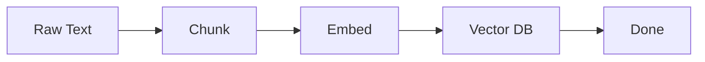
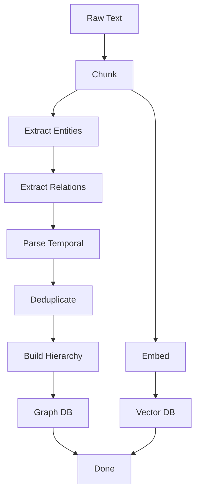
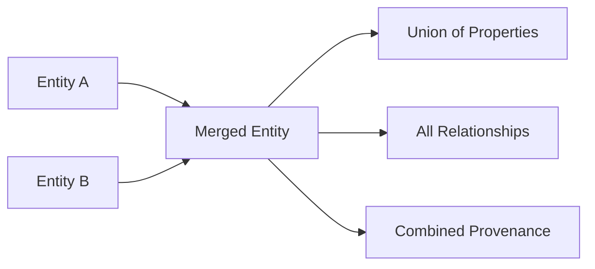
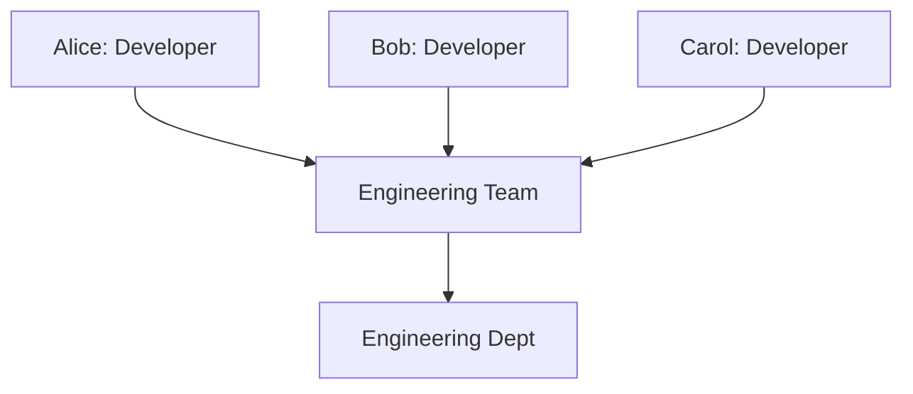

## Overview

**Ingestion** is the process of adding raw text data to your Intellibase project. The ingestion pipeline transforms unstructured text into structured knowledge that can be queried intelligently.

The pipeline behavior adapts based on your project mode:

<CardGroup cols={2}>
  <Card
    title="Vector-Only Mode"
    icon="bolt"
  >
    **Simple & Fast**
    - Chunk text
    - Create embeddings
    - Index in vector DB
  </Card>
  <Card
    title="KG + Vector Mode"
    icon="network-wired"
  >
    **Rich & Intelligent**
    - Chunk text
    - Extract entities
    - Extract relationships
    - Deduplicate
    - Build hierarchy
    - Index in graph + vector DB
  </Card>
</CardGroup>

## Ingestion Process

### Vector-Only Mode Pipeline



1. **Chunk**: Text is split into semantic chunks using Chonkie
2. **Embed**: Each chunk is converted to a vector embedding
3. **Store**: Embeddings are indexed in the vector database

**Typical Speed**: Fast (< 1 second per 1000 words)

### KG + Vector Mode Pipeline



1. **Chunk**: Text is split into semantic chunks
2. **Extract Entities**: LLM extracts entities defined in ontology (Level 0)
3. **Extract Relations**: LLM identifies relationships between entities
4. **Parse Temporal**: Extract temporal information (dates, time expressions)
5. **Deduplicate**: Merge duplicate entities using semantic + lexical search + LLM
6. **Build Hierarchy**: Create Level 1+ nodes and hierarchy edges
7. **Store**: Index in both graph database and vector database

**Typical Speed**: Moderate (5-10 seconds per 1000 words, LLM-dependent)

## Making an Ingestion Request

### Basic Ingestion

```bash
curl -X POST https://api.intellibase.dev/api/v1/projects/{project_id}/ingest \
  -H "Authorization: Bearer ib-your-api-key" \
  -H "Content-Type: application/json" \
  -d '{
    "text": "Your raw text content here...",
    "source_doc_id": "doc-001"
  }'
```

**Response:**

```json
{
  "job_id": "job-abc123",
  "status": "pending",
  "created_at": "2024-01-15T10:30:00Z"
}
```

### With Metadata

Add metadata to provide context for ingestion:

```bash
curl -X POST https://api.intellibase.dev/api/v1/projects/{project_id}/ingest \
  -H "Authorization: Bearer ib-your-api-key" \
  -H "Content-Type: application/json" \
  -d '{
    "text": "Alice joined the engineering team...",
    "source_doc_id": "doc-001",
    "metadata": {
      "title": "Team Update - January 2024",
      "author": "HR Department",
      "document_type": "announcement",
      "date": "2024-01-15",
      "department": "engineering"
    }
  }'
```

<Info>
  Metadata is stored with chunks and can be used for filtering queries. Include any contextual information that might be useful later.
</Info>

## Request Parameters

| Parameter | Type | Required | Description |
|-----------|------|----------|-------------|
| `text` | string | Yes | The raw text content to ingest |
| `source_doc_id` | string | Yes | Unique identifier for this document (for provenance tracking) |
| `metadata` | object | No | Additional context (title, author, date, tags, etc.) |

## Tracking Ingestion Jobs

### Job Statuses

Ingestion jobs progress through these statuses:

- **`pending`**: Job is queued, waiting to start
- **`running`**: Ingestion is in progress
- **`completed`**: Successfully finished
- **`failed`**: Error occurred during processing

### Check Job Status

```bash
curl https://api.intellibase.dev/api/v1/projects/{project_id}/jobs/{job_id} \
  -H "Authorization: Bearer ib-your-api-key"
```

**Response:**

```json
{
  "job_id": "job-abc123",
  "project_id": "proj-xyz",
  "source_doc_id": "doc-001",
  "status": "completed",
  "chunks_processed": 12,
  "nodes_created": 8,
  "edges_created": 15,
  "started_at": "2024-01-15T10:30:00Z",
  "completed_at": "2024-01-15T10:30:15Z",
  "error_message": null
}
```

### List All Jobs

Get a paginated list of ingestion jobs for a project:

```bash
curl "https://api.intellibase.dev/api/v1/projects/{project_id}/jobs?limit=50&offset=0" \
  -H "Authorization: Bearer ib-your-api-key"
```

**Response:**

```json
{
  "jobs": [
    {
      "job_id": "job-abc123",
      "status": "completed",
      "chunks_processed": 12,
      "nodes_created": 8,
      "edges_created": 15,
      "started_at": "2024-01-15T10:30:00Z",
      "completed_at": "2024-01-15T10:30:15Z"
    },
    ...
  ],
  "total": 145,
  "limit": 50,
  "offset": 0
}
```

## Async vs Sync Ingestion

Intellibase supports two ingestion modes:

<Tabs>
  <Tab title="Async (Default)">
    ### Asynchronous Ingestion
    
    Jobs are queued and processed by background workers.
    
    **How it works:**
    1. Submit ingestion request → Get job ID immediately
    2. Job is queued in Redis
    3. Celery worker picks up and processes job
    4. Poll job status to check completion
    
    **Best for:**
    - Production deployments
    - Large documents
    - High throughput
    - When you can poll for status
    
    ```bash
    # Submit returns immediately
    curl -X POST .../ingest -d '{...}'
    # Returns: { "job_id": "...", "status": "pending" }
    
    # Poll status later
    curl .../jobs/{job_id}
    # Returns: { "status": "completed", ... }
    ```
  </Tab>
  
  <Tab title="Sync">
    ### Synchronous Ingestion
    
    Request blocks until ingestion completes.
    
    **How it works:**
    1. Submit ingestion request
    2. Ingestion runs immediately in the request
    3. Response includes completed job status
    
    **Best for:**
    - Development and testing
    - Small documents
    - Simple deployments without workers
    - When you need immediate confirmation
    
    **Configuration:**
    ```bash
    # Set environment variable
    export INTELLIBASE_USE_ASYNC_INGESTION=false
    ```
    
    **Limitations:**
    - Request times out for large documents
    - Lower throughput
    - Single-threaded processing
  </Tab>
</Tabs>

## Chunking Strategy

Intellibase uses **Chonkie** for intelligent semantic chunking:

### Chunking Modes

<AccordionGroup>
  <Accordion title="Semantic Chunking (Default)">
    Splits text based on semantic boundaries using sentence embeddings.
    
    **Best for:**
    - Natural language text
    - Documents, articles, emails
    - When semantic coherence matters
  </Accordion>
  
  <Accordion title="Token-Aware Splitting">
    Respects token limits while preserving sentence boundaries.
    
    **Best for:**
    - Controlling costs (tokens → embeddings/LLM calls)
    - Ensuring chunks fit in model context windows
  </Accordion>
</AccordionGroup>

### Chunk Size Guidelines

| Chunk Size | Best For | Trade-offs |
|------------|----------|------------|
| 256-512 tokens | Precise facts, Q&A | More chunks, higher cost, less context per chunk |
| 512-1024 tokens | **Balanced (Recommended)** | Good precision + context balance |
| 1024-2048 tokens | Long-form content, summaries | Fewer chunks, more context, less precision |

<Info>
  **Recommended**: Start with 512 tokens and 50 token overlap. Adjust based on your query patterns.
</Info>

## Entity Extraction (KG Mode)

For KG+Vector projects, Intellibase extracts entities using LLMs:

### How Extraction Works

1. **LLM receives:**
   - Text chunk
   - Ontology (Level 0 node types only)
   - Extraction prompt
   
2. **LLM returns:**
   - List of entities with type, name, properties
   - Confidence scores
   
3. **Intellibase validates:**
   - Types match ontology
   - Properties are valid
   - Confidence meets threshold

### Extraction Quality

Factors affecting extraction quality:

- **Ontology clarity**: Clear, specific type definitions improve extraction
- **LLM model**: More capable models (GPT-4, Groq) extract better
- **Text quality**: Well-written text extracts more reliably
- **Domain fit**: Ontology matched to domain improves results

## Deduplication (KG Mode)

Intellibase automatically merges duplicate entities:

### Two-Stage Deduplication

**Stage 1: Candidate Retrieval**
- Semantic search (vector similarity > 0.85)
- Full-text search (BM25 lexical matching)
- Union of candidates

**Stage 2: LLM Decision**
- LLM compares entity pairs
- Returns: duplicate yes/no + merge strategy
- Merges properties and relationships

### Merge Strategies



- **Properties**: Union with conflict resolution (newer wins)
- **Relationships**: Preserve all, update temporal validity
- **Provenance**: Track all source documents

## Hierarchy Building (KG Mode)

After extracting Level 0 entities, Intellibase builds higher abstraction levels:

### Bottom-Up Construction



1. Start with Level 0 entities (Alice, Bob, Carol)
2. **For each entity:**
   - Search for existing Level 1 parent
   - If match found → Create `BELONGS_TO` edge
   - If no match → Create new Level 1 node → Create edge
3. Repeat for Level 2+

### Matching Algorithm

How Intellibase decides if an entity belongs to an existing parent:

1. **Semantic similarity**: Compare embeddings
2. **LLM classification**: "Does Developer Alice belong to Engineering Team?"
3. **Ontology rules**: Check valid parent types

## Best Practices

<AccordionGroup>
  <Accordion title="Batch Related Documents">
    Ingest related documents together to help entity resolution:
    
    ```bash
    # Good: Related content
    ingest("Alice joined the team")
    ingest("Alice is working on Feature-X")
    # → Same "Alice" entity
    
    # Less ideal: Isolated fragments
    ingest("Alice") 
    # Wait 1 week...
    ingest("Alice on Feature-X")
    # → Might create duplicate Alice
    ```
  </Accordion>
  
  <Accordion title="Use Meaningful source_doc_id">
    Make document IDs descriptive for easier provenance tracking:
    
    ```bash
    # Good
    "source_doc_id": "email-2024-01-15-engineering-update"
    
    # Less useful
    "source_doc_id": "doc-1"
    ```
  </Accordion>
  
  <Accordion title="Include Temporal Context">
    Help temporal parsing by including dates in text or metadata:
    
    ```json
    {
      "text": "Alice joined on January 15, 2024...",
      "metadata": {
        "document_date": "2024-01-15"
      }
    }
    ```
  </Accordion>
  
  <Accordion title="Monitor Job Status">
    Especially for async ingestion, monitor jobs for failures:
    
    ```python
    import time
    
    # Submit job
    response = requests.post(f"{BASE_URL}/projects/{project_id}/ingest", ...)
    job_id = response.json()["job_id"]
    
    # Poll until complete
    while True:
        status_response = requests.get(
            f"{BASE_URL}/projects/{project_id}/jobs/{job_id}",
            headers=headers
        )
        job = status_response.json()
        
        if job["status"] == "completed":
            print(f"Processed {job['chunks_processed']} chunks")
            break
        elif job["status"] == "failed":
            print(f"Error: {job['error_message']}")
            break
        
        time.sleep(2)
    ```
  </Accordion>
  
  <Accordion title="Handle Failures Gracefully">
    Ingestion can fail for various reasons:
    
    - LLM API errors (retryable)
    - Malformed text (fix input)
    - Database connection issues (retryable)
    - Token limits exceeded (upgrade plan)
    
    Always check `error_message` on failed jobs and implement retry logic.
  </Accordion>
</AccordionGroup>

## Performance Considerations

### Ingestion Speed

**Vector-Only Mode:**
- ~1,000 words/second
- Limited by embedding API

**KG+Vector Mode:**
- ~100-200 words/second
- Limited by LLM extraction

### Optimization Tips

<CardGroup cols={2}>
  <Card
    title="Use Async Ingestion"
    icon="clock"
  >
    Enable background workers for better throughput
  </Card>
  <Card
    title="Batch Documents"
    icon="layer-group"
  >
    Submit multiple documents concurrently
  </Card>
  <Card
    title="Tune Chunk Size"
    icon="sliders"
  >
    Larger chunks = fewer LLM calls
  </Card>
  <Card
    title="Choose Fast LLMs"
    icon="bolt"
  >
    Groq is faster than OpenAI for extraction
  </Card>
</CardGroup>

## Next Steps

<CardGroup cols={2}>
  <Card
    title="Query Your Data"
    icon="magnifying-glass"
    href="/concepts/querying"
  >
    Learn how to query ingested knowledge
  </Card>
  <Card
    title="Ingestion API"
    icon="code"
    href="/api-reference/ingestion/ingest"
  >
    View the full API reference
  </Card>
</CardGroup>

